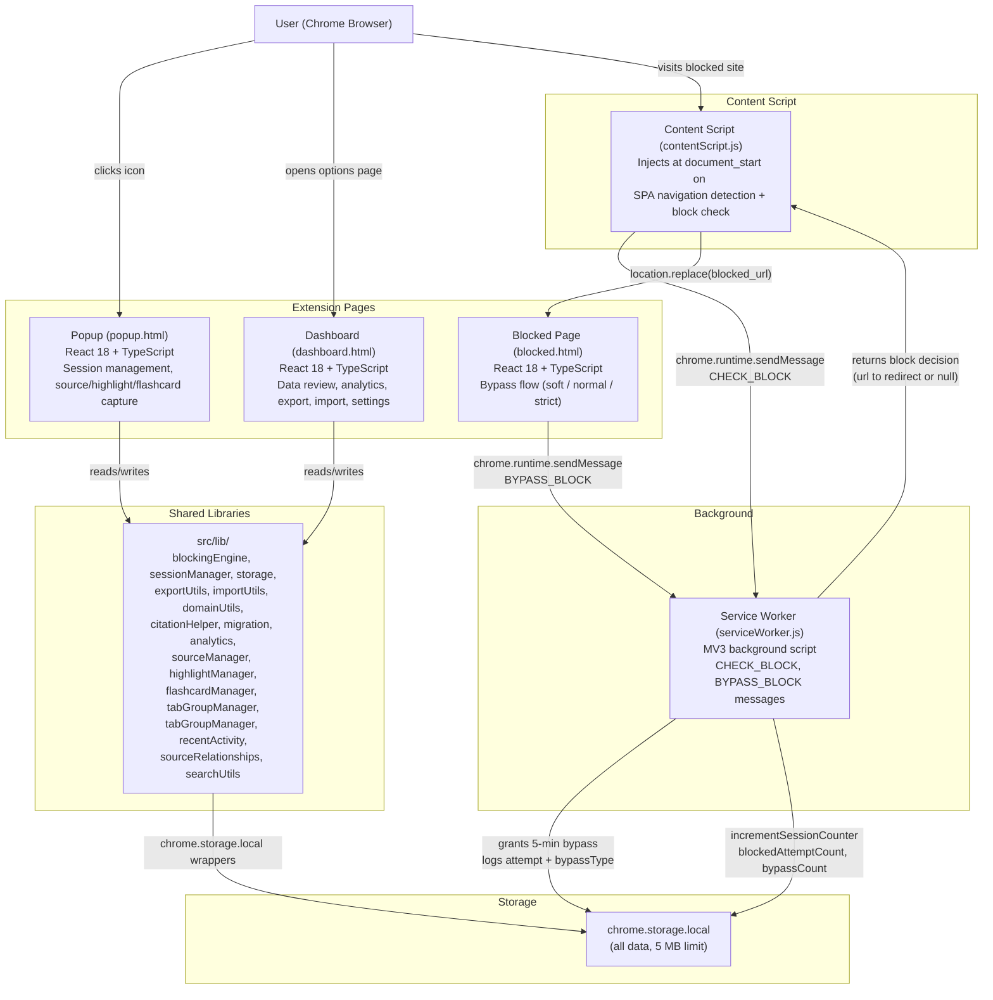
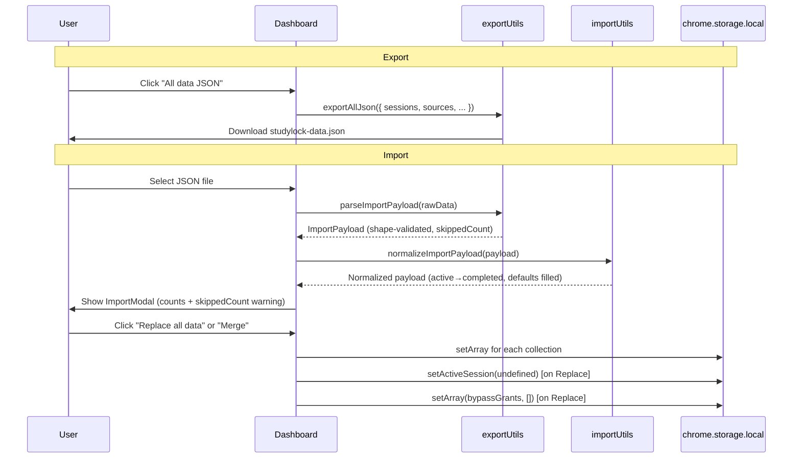
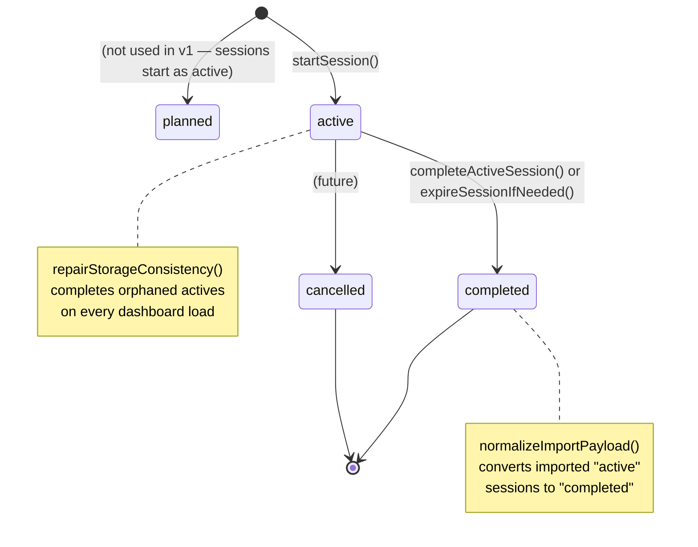
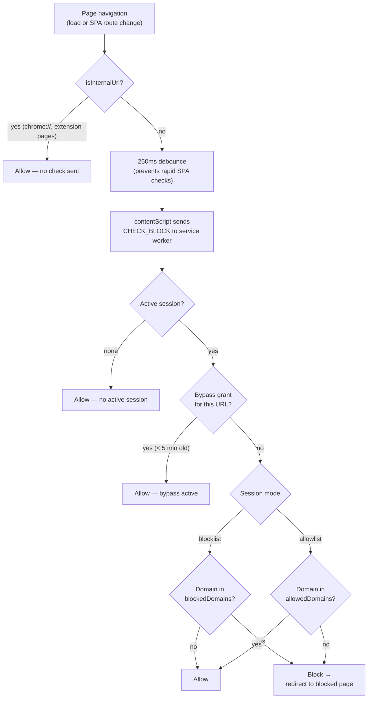

# StudyLock — Architecture Diagram

This document describes the runtime architecture of the StudyLock Chrome extension using Mermaid diagrams.

---

## Extension Context Map

---

## Import / Export Data Flow

---

## Session Lifecycle

---

## Blocking Decision Flow

---

## Storage Keys Reference

| Key | Type | Description |
|---|---|---|
| `studylock_sessions` | `StudySession[]` | All sessions (active, completed, cancelled) |
| `studylock_active_session_id` | `string \| null` | ID of the current active session |
| `studylock_blocked_attempts` | `BlockedAttempt[]` | Every blocked page attempt with bypass info |
| `studylock_sources` | `SavedSource[]` | Saved web sources with citation drafts |
| `studylock_highlights` | `HighlightNote[]` | Text highlights with notes |
| `studylock_flashcards` | `Flashcard[]` | Study flashcards |
| `studylock_tab_groups` | `TabGroup[]` | Saved tab group snapshots |
| `studylock_settings` | `Settings` | User preferences |
| `studylock_bypass_grants` | `BypassGrant[]` | Temporary URL unlock grants (expire in 5 min) |
| `studylock_schema_version` | `number` | Schema version for migrations |

---

## Key Design Constraints

- **Local-first**: No network requests, no backend, no account. All data in `chrome.storage.local`.
- **MV3**: Service worker (not persistent background page). Background logic runs on-demand via messages.
- **Session expiry**: Sessions expire when the extension is next used (popup open, blocking check, dashboard load) — not via a background timer.
- **Blocking scope**: Content script runs on all URLs but skips internal pages. Close Distracting Tabs scans only the current window.
- **No device-level lockdown**: Students can disable an unpacked extension from Chrome settings. The friction model is deliberate, not absolute.
- **CSP**: `script-src 'self'; object-src 'self'` — no remote scripts, no `eval`, no `unsafe-inline`.
